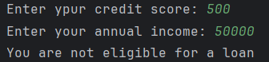
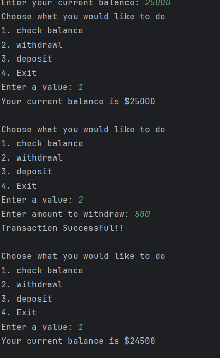
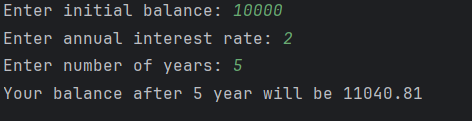
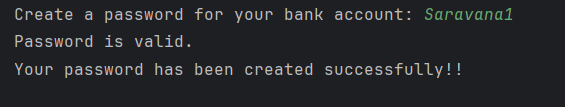
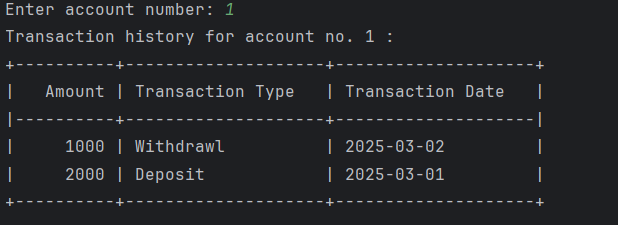

# <p align='center'> Assignment Banking system - Python tasks</p>
### Name: Saravana Kumar S
Superset ID: 5371342<br>
College: Saveetha Engineering college

## Task 1: Conditional Statements
In a bank, you have been given the task is to create a program that checks if a customer is eligible for 
a loan based on their credit score and income. The eligibility criteria are as follows: 
• Credit Score must be above 700. 
• Annual Income must be at least $50,000. 
Tasks: 
1. Write a program that takes the customer's credit score and annual income as input. 
2. Use conditional statements (if-else) to determine if the customer is eligible for a loan. 
3. Display an appropriate message based on eligibility.
```py
credit_score = int(input("Enter ypur credit score: "))
annual_income = int(input("Enter your annual income: "))

if credit_score > 700 and annual_income >= 50_000:
    print("You are eligible for a loan ")
else:
    print("You are not eligible for a loan ")
 ```
 

## Task 2: Nested Conditional Statements 
Create a program that simulates an ATM transaction. Display options such as "Check Balance," 
"Withdraw," "Deposit,". Ask the user to enter their current balance and the amount they want to 
withdraw or deposit. Implement checks to ensure that the withdrawal amount is not greater than the 
available balance and that the withdrawal amount is in multiples of 100 or 500. Display appropriate 
messages for success or failure.
```py
curr_bal = int(input("Enter your current balance: "))
while True:
    print(
        "Choose what you would like to do\n"
        "1. check balance\n"
        "2. withdrawl\n"
        "3. deposit\n"
        "4. Exit")
    ask  = int(input("Enter a value: "))

    if ask == 1:
        print(f"Your current balance is ${curr_bal}\n")
    elif ask == 2:
        amt = int(input("Enter amount to withdraw: "))
        if amt <= curr_bal and amt%100 == 0:
            curr_bal -= amt
            print("Transaction Successful!!\n")
        elif amt > curr_bal:
            print("Insufficient Balance!!\n")
        else:
            print("Enter amount in multiples of 100 or 500\n")
    elif ask == 3:
        amt = int(input("Enter amount to be deposited: "))
        curr_bal += amt
        print("Transaction Successful!!")
        print(f"Current balance: {curr_bal}\n")
    elif ask == 4:
        break
    else:
        print("Please enter a valid value\n")
 ```
 

 ## Task 3: Loop Structures 
You are responsible for calculating compound interest on savings accounts for bank customers. You 
need to calculate the future balance for each customer's savings account after a certain number of years. 
Tasks: 
1. Create a program that calculates the future balance of a savings account. 
2. Use a loop structure (e.g., for loop) to calculate the balance for multiple customers. 
3. Prompt the user to enter the initial balance, annual interest rate, and the number of years. 
4. Calculate the future balance using the formula:      
future_balance = initial_balance * (1 + annual_interest_rate/100)^years. 
5. Display the future balance for each customer. 
```py
initial_balance = int(input("Enter initial balance: "))
annual_interest_rate = int(input("Enter annual interest rate: "))
number_of_years = int(input("Enter number of years: "))

future_balance = round(initial_balance * (1 + annual_interest_rate/100)**number_of_years,2)

print(f"Your balance after {number_of_years} year will be {future_balance}")
 ```
 

## Task 4: Looping, Array and Data Validation 
You are tasked with creating a program that allows bank customers to check their account balances. 
The program should handle multiple customer accounts, and the customer should be able to enter their 
account number, balance to check the balance. 
Tasks: 
1. Create a Python program that simulates a bank with multiple customer accounts. 
2. Use a loop (e.g., while loop) to repeatedly ask the user for their account number and 
balance until they enter a valid account number. 
3. Validate the account number entered by the user. 
4. If the account number is valid, display the account balance. If not, ask the user to try again.

```py
while True:
    try:
        account = int(input("Enter your account number: "))

        cursor.execute("SELECT balance FROM Accounts WHERE account_id = %s", (account,))
        result = cursor.fetchone()

        if result:
            print(f"Available balance: {result[0]}")
            break
        else:
            print("Enter a valid account number...\n")

    except ValueError:
        print("Please enter a valid numeric account number.")
```
 

 ## Task 5: Password Validation 
Write a program that prompts the user to create a password for their bank account. Implement if 
conditions to validate the password according to these rules: 
• The password must be at least 8 characters long. 
• It must contain at least one uppercase letter. 
• It must contain at least one digit. 
• Display appropriate messages to indicate whether their password is valid or not.

```py
def validate_password(password):
    if len(password) < 8:
        return False, "Password must be at least 8 characters long."
    if not any(char.isupper() for char in password):
        return False, "Password must contain at least one uppercase letter."
    if not any(char.isdigit() for char in password):
        return False, "Password must contain at least one digit."

    return True, "Password is valid."
while True:
    password = input("Create a password for your bank account: ")
    is_valid, message = validate_password(password)
    if is_valid:
        print(message, "\nYour password has been created successfully!!")
        break
    else:
        print("Invalid password.\n" + message + "\n")
```
 

 ## Task 6: Transactions
Create a program that maintains a list of bank transactions (deposits and withdrawals) for a customer. 
Use a while loop to allow the user to keep adding transactions until they choose to exit. Display the 
transaction history upon exit using looping statements.
```py
account = int(input("Enter account number: "))

print(f"Transaction history for account no. {account} :")

query = """
    SELECT amount, transaction_type, transaction_date 
    FROM Transactions 
    WHERE account_id = %s
    ORDER BY transaction_date DESC
"""
cursor.execute(query, (account,))
rows = cursor.fetchall()

if rows:
    headers = ["Amount", "Transaction Type", "Transaction Date"]
    print(tabulate(rows, headers=headers, tablefmt="psql"))
else:
    print("No transactions found for this account.")
```
