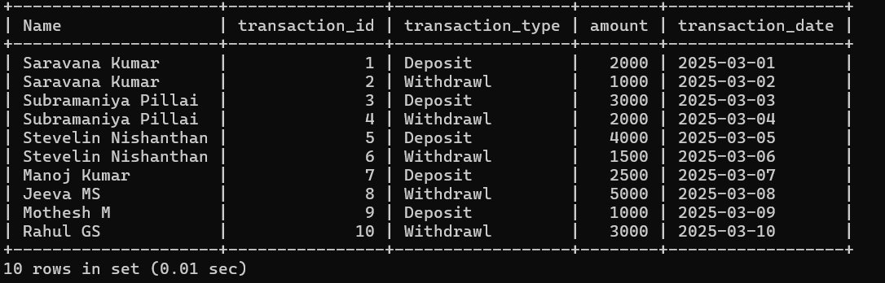

# Assignment-Banking-system
## Task 1: Database creation
1. Create the database named "HMBank"
```sql
 CREATE DATABASE HMBank;
 USE HMBank;
 ```
 

 2. Define the schema for the Customers, Accounts, and Transactions tables based on the provided schema.
- Customers Table:
    - `customer_id`: A unique ID for each customer (used as the primary key).
    - `first_name`: The customer's first name (text).
    - `last_name`: The customer's last name (text).
    - `DOB`:  The customer's date of birth.
    - `email`: The customer's email address (text).
    - `phone_number`: The customer's 10-digit phone number. It must be exactly 10 digits.
    - `perm_address`: The customer's permanent address (text).

- Accounts Table:
    - `account_id`: A unique ID for each account (used as the primary key).
    - `customer_id`: The ID of the customer who owns the account. This links to the customer_id in the Customers Table.
    - `account_type`:The type of account, like "Savings" or "Current" (text).
    - `balance`: The amount of money in the account. Starts at 0 by default and cannot be negative.

- Transactions Table
    - `transaction_id`:A unique ID for each transaction (used as the primary key).
    - `account_id`: The ID of the account involved in the transaction. This links to the account_id in the Accounts Table.
    - `transaction_type`: The type of transaction, like "Deposit" or "Withdrawal" (text).
    - `amount`: The amount of money involved in the transaction. It must be a positive number and cannot be null.
    - `transaction_date`:The date when the transaction happened.

3. Create an ERD (Entity Relationship Diagram) for the database.
    

4. Create appropriate Primary Key and Foreign Key constraints for referential integrity.
- Primary Keys:
    - Customers: `customer_id`
    - Accounts: `account_id`
    - Transactions: `transaction_id`

- Foreign Keys:
    - Accounts references Customers: `customer_id`
    - Transactions references Accounts: `account_id`

6. Write SQL scripts to create the mentioned tables with appropriate data types, constraints, 
and relationships.   
• Customers  
• Accounts

    • Transactions 

```sql
CREATE TABLE Customers(
    -> customer_id INT,
    -> first_name VARCHAR(200),
    -> last_name VARCHAR(200),
    -> DOB DATE,
    -> email VARCHAR(200),
    -> phone_number INT CHECK (CHAR_LENGTH(phone_number) = 10),
    ->  perm_address VARCHAR(200),
    -> PRIMARY KEY (customer_id)
    -> );
```


```sql
 CREATE TABLE Accounts (
    -> account_id INT,
    -> customer_id INT,
    -> account_type VARCHAR(200),
    -> balance INT DEFAULT 0 CHECK (balance >= 0),
    -> PRIMARY KEY (account_id),
    -> FOREIGN KEY (customer_id) REFERENCES Customers(customer_id)
    -> );
```


```sql
 CREATE TABLE Transactions (
    -> transaction_id INT,
    -> account_id INT,
    -> transaction_type VARCHAR(200),
    -> amount INT CHECK (amount > 0),
    -> transaction_date DATE,
    -> PRIMARY KEY (transaction_id),
    -> FOREIGN KEY (account_id) REFERENCES Accounts(account_id)
    -> );
```


## Task 2: Select, Where, Between, AND, LIKE

1. Insert at least 10 sample records into each of the following tables.   
• Customers  
• Accounts

    • Transactions

```sql
mysql> INSERT INTO Customers (customer_id, first_name, last_name, DOB, email, phone_number, perm_address)
    -> VALUES
    -> (1, 'Saravana', 'Kumar', '2000-10-14', 'saravana.work@gmail.com', 9876543210, '123 chennai'),
    -> (2, 'Subramaniya', 'Pillai', '2003-09-21', 'subramaniya.123@gmail.com', 8765432109, '456 Mogappair'),
    -> (3, 'Stevelin', 'Nishanthan', '2004-02-18', 'steveliniaric@gmail.com', 7654321098, '789 Perambur'),
    -> (4, 'Manoj', 'Kumar', '2003-12-14', 'manoj123@gmail.com', 6543210987, '321 Pallavaram'),
    -> (5, 'Jeeva', 'MS', '2003-11-15', 'jeeva123@gmail.com', 5432109876, '654 Salem'),
    -> (6, 'Mothesh', 'M', '2004-10-15', 'mothesh123@gmail.com', 4321098765, '987 Iyyapanthangal'),
    -> (7, 'Rahul', 'GS', '2003-10-25', 'rahul.gs@gmail.com', 3210987654, '123 Iyyapanthangal'),
    -> (8, 'Gokul', 'Anand', '2005-06-15', 'gokul.d1@gmail.com', 2109876543, '456 Mogappair'),
    -> (9, 'Mithun', 'Ram', '2005-10-10', 'mithun.123@gmail.com', 1098765432, '789 Poonamalleee'),
    -> (10, 'Vidya', 'Neela', '2003-05-07', 'vidyaneela@gmail.com', 1987654321, '321 sriperambathur');
```


```sql
INSERT INTO Accounts (account_id, customer_id, account_type, balance)
VALUES
(1, 1, 'Savings', 5000),
(2, 2, 'Current', 10000),
(3, 3, 'Savings', 7000),
(4, 4, 'Savings', 3000),
(5, 5, 'Current', 15000),
(6, 6, 'Savings', 2000),
(7, 7, 'Current', 8000),
(8, 8, 'Savings', 4000),
(9, 9, 'Current', 12000),
(10, 10, 'Savings', 2500);
```


```sql
INSERT INTO Transactions (transaction_id, account_id, transaction_type, amount, transaction_date)
VALUES
(1, 1, 'Deposit', 2000, '2025-03-01'),
(2, 1, 'Withdrawl', 1000, '2025-03-02'),
(3, 2, 'Deposit', 3000, '2025-03-03'),
(4, 2, 'Withdrawl', 2000, '2025-03-04'),
(5, 3, 'Deposit', 4000, '2025-03-05'),
(6, 3, 'Withdrawl', 1500, '2025-03-06'),
(7, 4, 'Deposit', 2500, '2025-03-07'),
(8, 5, 'Withdrawl', 5000, '2025-03-08'),
(9, 6, 'Deposit', 1000, '2025-03-09'),
(10, 7, 'Withdrawl', 3000, '2025-03-10');
```


2. Write SQL queries for the following tasks:
- 1. Write a SQL query to retrieve the name, account type and email of all customers.
```sql
 SELECT CONCAT(c.first_name, ' ',c.last_name) AS Name, a.account_type, c.email
    -> FROM Customers c INNER JOIN Accounts a
    -> ON c.customer_id = a.customer_id;
```


- 2. Write a SQL query to list all transaction corresponding customer.
```sql
 SELECT CONCAT(c.first_name, ' ', c.last_name) AS Name, t.transaction_id, t.transaction_type, t.amount, t.transaction_date
    -> FROM Customers c INNER JOIN Accounts a ON c.customer_id = a.customer_id
    -> INNER JOIN Transactions t ON a.account_id = t.account_id;
```


- 3. Write a SQL query to increase the balance of a specific account by a certain amount.
```sql
UPDATE Accounts
SET balance = balance + 2000
WHERE account_id = 5;
```
- 4. Write a SQL query to Combine first and last names of customers as a full_name.
```sql
SELECT CONCAT(first_name, ' ', last_name) AS full_name
FROM Customers;
```


- 5. Write a SQL query to remove accounts with a balance of zero where the account type is savings.
```sql
DELETE FROM Accounts WHERE balance = 0 AND account_type = 'savings';
```

- 6. Write a SQL query to Find customers living in a specific city.
```sql
SELECT * FROM Customers WHERE perm_address LIKE '%Iyyapanthangal%';
```


- 7. Write a SQL query to Get the account balance for a specific account.
```sql
SELECT balance FROM Accounts WHERE account_id = 4;
```


- 8. Write a SQL query to List all current accounts with a balance greater than $1,000.
```sql
SELECT * FROM Accounts 
WHERE account_type = 'current' AND balance > 1000;
```


- 9. Write a SQL query to Retrieve all transactions for a specific account.
```sql
 SELECT * FROM Transactions t
    -> INNER JOIN Accounts a ON t.account_id = a.account_id
    -> WHERE a.account_id = 2;
```


- 10. Write a SQL query to Calculate the interest accrued on savings accounts based on a given interest rate.
```sql
SELECT account_id, balance*(0.2) AS interest FROM Accounts
WHERE account_type = 'savings';
```


- 11.  Write a SQL query to Identify accounts where the balance is less than a specified overdraft limit.
```sql
 SELECT * FROM Accounts WHERE balance < 5000;
 ```
 

 - 12. Write a SQL query to Find customers not living in a specific city.
 ```sql
  SELECT * FROM Customers WHERE perm_address NOT LIKE '%Iyyapanthangal%';
  ```
  